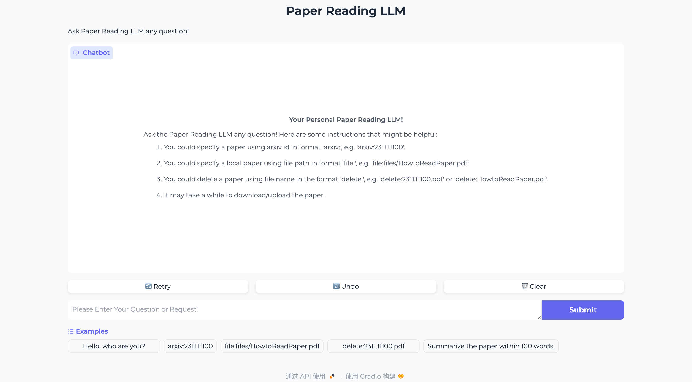

<!--
 * @Author             : 陈蔚 (weichen.cw@zju.edu.cn)
 * @Date               : 2024-08-14 10:47
 * @Last Modified By   : 陈蔚 (weichen.cw@zju.edu.cn)
 * @Last Modified Date : 2024-08-20 13:31
 * @Description        : This is REAME file for paper reading LLM.
 * -------- 
 * Copyright (c) 2024 Wei Chen. 
-->

# Paper Reading LLM

This is a toy demo of constructing **a Web UI for an LLM** capable of assisting and accelerating paper reading.



We use `qwen-long` here for its low cost, but you could alternatively use other LLMs as long as they support `openai` API.

> `qwen-long` costs 0.5 yuan/1M tokens for input, which approximately equals 0.07 USD/1M tokens.

## 1. Installation

1. Clone the repository and install the required packages:


```bash
conda create -n paper-reading-llm python=3.11
pip install -r requirements.txt
```

**Required packages:**
- `feedparser`: Parse ArXiv feed;
- `openai`: Interact with OpenAI API;
- `gradio`: Construct the interface;

## 2. Usage

First, open [Alibaba Cloud website](https://help.aliyun.com/zh/model-studio/developer-reference/qwen-long-api), create account and get your `qwen-long` access key.

Second, open `src/config_and_variable.py` file and modify the following variables:
- `USE_PROXY`: Set to `True` if you need to use proxy;
- `*_PROXY`: Set to your proxy if needed;
- `ENDPOINT`: The endpoint for your LLM service provider;
- `MODEL_TYPE`: The model you want to use.

Finally, Run the following command to start the interface in a web browser:

```bash
python webapp.py --accessKey <your_qwen_long_access_key>
```

Or in the terminal:

```bash
python main.py --accessKey <your_qwen_long_access_key>
```

Arguments:
- `accessKey`: The access key for `qwen-long`, e.g. `sk-xxxxxxxxxx`;
- `useProxy`: Whether to use proxy.

If you use Web APP, the interface will be available at `http://localhost:7860`. Enjoy yourself!

### 2.1 Functions

I'm unfamiliar with Gradio, so I use the most naive way to implement the functions. You need to type some keywords in the chat box to perform the following functions:

- **Chat**: You could directly chat with LLM using the interface;
- **Download from ArXiv**: Download papers from ArXiv. You could specify a paper using an arxiv id in the format `arxiv:<arxiv_id>`, e.g. 'arxiv:2311.11100';
- **Upload from disk**: Upload papers from disk. You could specify a local paper using a file path in the format `file:<your_file_path>`, e.g. 'file:~/papr.pdf';
- **Delete from Cloud**: Delete papers from cloud. You could delete a paper using a file name in the format `delete:<arxiv_id/file_name>`, e.g. 'delete:2311.11100.pdf' or 'delete:paper.pdf';

After downloading & uploading, you could chat with LLM about the paper.

> **NOTE**: Although I keep the Retry Button in the interface, the default temperature for `qwen-long` might be 0, so that you might always get the same answer.

## 3. File Structure

```bash
.
├── README.md
├── files
│   └── HowtoReadPaper.pdf
├── main.py
├── requirements.txt
├── src
│   ├── __init__.py
│   ├── arguments.py
│   ├── config_and_variables.py
│   ├── process_file.py
│   ├── query_api.py
│   └── utils.py
└── webapp.py
```

**File Contents:**
- `README.md`: This is the README file for paper reading LLM;
- `main.py`: Configuration file for the interface;
- `webapp.py`: The main interface file;
- `requirements.txt`: The required packages;
- `src/process_file.py`: Process the paper file;
- `src/query_api.py`: Functions for querying the LLM;
- `src/utils.py`: Utility functions;
- `files/HowtoReadPaper.pdf`: This is an example paper.

## 4. FAQ

TO BE COMPLETED.

If you have any questions, please feel free to contact me.
> **Email**: weichen.cw@zju.edu.cn

**Question**: 

**Answer**: 

## 5. Acknowledgment

The following resources inspire this project:
- [Qwen-Long API](https://help.aliyun.com/zh/model-studio/developer-reference/qwen-long-api): Thanks for the cheap but powerful LLM;
- [Arxiv API](https://info.arxiv.org/help/api/index.html): Thank you to arXiv for use of its open access interoperability.;
- [Gradio](https://www.gradio.app/): Thanks for the easy-to-use interface construction.
- [How to Read a Paper](https://www.cs.cmu.edu/~zhihaoj2/papers/HowtoReadPaper.pdf): Thanks for the paper reading guide.
